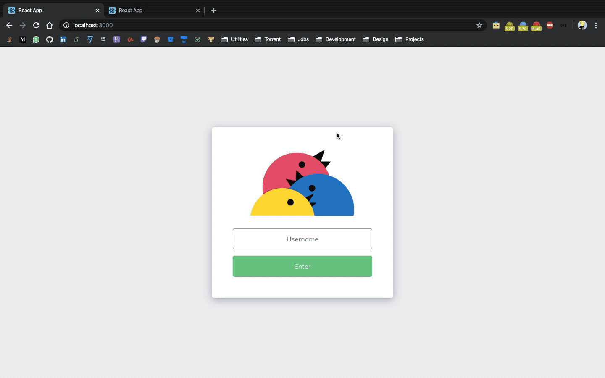

<h1 align="center">Chat App</h1>

> You can find all the project specifications [here](https://github.com/florinpop17/app-ideas/blob/master/Projects/3-Advanced/Chat-App.md)

Tier: 3-Advanced

Real-time chat interface where multiple users can interact with each other by sending messages.

As a MVP(Minimum Viable Product) you can focus on building the Chat interface. Real-time functionality can be added later (the bonus features).

## User Stories

-   [x] User is prompted to enter a username when he visits the chat app. The username will be stored in the application
-   [x] User can see an `input field` where he can type a new message
-   [ ] By pressing the `enter` key or by clicking on the `send` button the text will be displayed in the `chat box` alongside his username (e.g. `John Doe: Hello World!`)

## Bonus features

-   [x] The messages will be visible to all the Users that are in the chat app (using WebSockets)
-   [x] When a new User joins the chat, a message is displayed to all the existing Users
-   [x] Messages are saved in a database - *adapted to local variable on NodeJS server

## Print

<p align="center">
  
</p>

## Useful links and resources

-   [Socket.io](https://socket.io)

## How to use

```
# Clone this repository
$ git clone https://github.com/feMoraes0/chat-app.git

# Go into the repository
$ cd chat-app

# Move server out
$ mv ./chat-server ../

# Go into the repository
$ cd ../chat-server

# Install server dependencies
$ npm install

# Run the server
$ npm start

# Open a new terminal and go into the chat-app folder again

# Install dependencies
$ npm install

# Run the app
$ npm start
```

## Contact

  - <a target="_blank" href="https://www.linkedin.com/in/fernando-moraes-48a26916a/">LinkedIn</a>
  - <a target="_blank" href="mailto:fernandomoraes.lopes@gmail.com">E-mail</a>